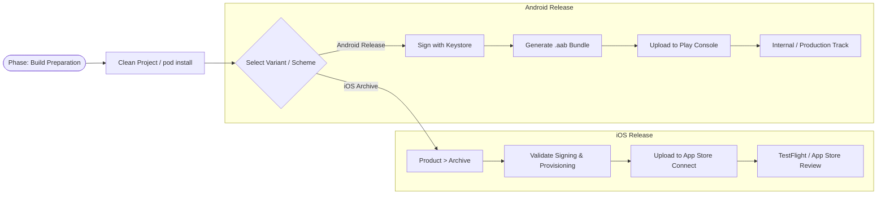

# Deployment Documentation

## Overview
This guide provides step-by-step instructions for building and deploying the Template application to the Google Play Store and Apple App Store across multiple environments.

### **Build & Release Pipeline**

---

## 1. Environment & Build Mapping
The project uses `react-native-config` to manage environments. Each build variant/scheme is mapped to a specific `.env` file.

| Environment | Android Flavor | iOS Scheme | Env File |
| :--- | :--- | :--- | :--- |
| **Development** | `development` | `templateDevelopment` | `.env.development` |
| **Staging** | `staging` | `templateStaging` | `.env.staging` |
| **QA** | `qa` | `templateQA` | `.env.qa` |
| **UAT** | `uat` | `templateUAT` | `.env.uat` |
| **Production** | `production` | `template` | `.env.production` |

---

## 2. Android: Building & Play Store Upload

### **Building with Android Studio**
1. **Open Project**: Open the `android` folder in Android Studio.
2. **Select Variant**: Open the **Build Variants** tab (usually bottom left). Select the desired variant (e.g., `productionRelease`, `stagingRelease`).
3. **Clean Project**: Go to `Build > Clean Project`.
4. **Generate Bundle**: Go to `Build > Generate Signed Bundle / APK...`.
5. **KeyStore**:
   - For **Release** builds, you must use the production release keystore.
   - For **Debug/QA** builds, the project is configured to use the app-specific keystores defined in `gradle.properties`.
6. **Export**: Choose **Android App Bundle (.aab)** for store uploads as it generates optimized APKs for different devices.

### **Uploading to Google Play Console**
1. Log in to the [Google Play Console](https://play.google.com/console/).
2. Select the **Template** application.
3. Navigate to **Testing > Closed testing** (for QA/Staging/UAT) or **Production**.
4. Create a new release and upload the `.aab` file generated by Android Studio.
5. Provide release notes and submit for review.

---

## 3. iOS: Building & App Store Upload

### **Building with Xcode**
1. **Open Workspace**: Open `ios/template.xcworkspace` in Xcode.
2. **Select Scheme**: Select the correct scheme (e.g., `template` for Prod, `templateStaging` for Staging) from the top-center dropdown.
3. **Device Selection**: Set the target to **Any iOS Device (arm64)**.
4. **Versioning**: Increment the **Build Number** in the General settings tab.
5. **Archive**: Go to `Product > Archive`. This will trigger a production build.

### **Uploading to App Store Connect**
1. Once the Archive is complete, the **Organizer** window will open.
2. Select the latest archive and click **Distribute App**.
3. Choose **App Store Connect** and then **Upload**.
4. Xcode will perform a series of validations (Signing, Provisioning).
5. Once uploaded, log in to [App Store Connect](https://appstoreconnect.apple.com/).
6. **TestFlight**: For internal/QA testing, select the build in the TestFlight tab and add testers.
7. **Production**: Go to the **App Store** tab, create a new version, select the uploaded build, and submit for review.

---

## 4. Environment-Specific Logic
- **Bundle IDs (Android)**:
  - Prod: `com.rntstemplate`
  - Staging: `com.rntstemplate.staging`
  - QA: `com.rntstemplate.qa`
  - UAT: `com.rntstemplate.uat`
  - Dev: `com.rntstemplate.development`
- **Bundle IDs (iOS)**:
  - Prod: `com.mindbowser.rnts`
  - Staging: `com.mindbowser.rnts.staging`
  - QA: `com.mindbowser.rnts.qa`
  - UAT: `com.mindbowser.rnts.uat`
  - Dev: `com.mindbowser.rnts.development`
- **Firebase**: Ensure the correct `google-services.json` (Android) and `GoogleService-Info.plist` (iOS) are used for each build variant. In this project, they are managed via Gradle flavors and Xcode build phases.

---

## Best Practices
- **Version Management**: Always use the versioning scripts (`yarn version-major/minor/patch`) to keep labels consistent across JS and Native layers.
- **Pre-Archive Check**: Always run `cd ios && pod install` before archiving in Xcode to ensure native dependencies are linked correctly.
- **Keystore Security**: **NEVER** commit production keystore passwords to the repository. Use environment variables or secure vault storage for CI/CD or local release builds.
